<!-- hero: monochrome ASCII portrait (types in) beside a neofetch-style info
     panel. regenerate portrait: python make_ascii_svg_illustration_v5.py <photo> ascii.svg
     info panel: python make_info_card.py -->

<!-- animated contribution graph: real data, boxes pop + flash in
     (regenerated nightly + on push by .github/workflows/heatmap.yml) -->

<h3><code>whokrishverma@github ~ $ ./contributions.sh</code></h3>

 
 

<h3><code>whokrishverma@github ~ $ whoami</code></h3>

<table>
<tr>
<td valign="top"></td>
<td valign="top"></td>
</tr>
</table>

 
 

<h3><code>whokrishverma@github ~ $ ./links.sh</code></h3>

<!-- 
<b>AI/ML Intern @ Mankind</b>
 -->

<!-- raw <a> tags (not markdown links) so target="_blank" works -->

 

